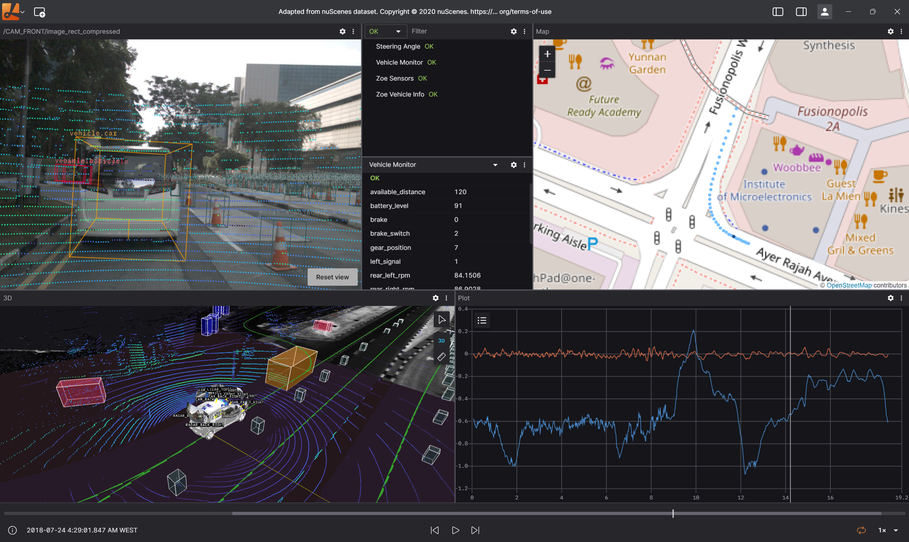

<h1 align="center">Nav-Tools V2.0</h1>

<div align="center">
  <p>
    <strong>二次开发自 <a href="https://github.com/lichtblick-suite/lichtblick">lichtblick</a> 项目 316dcfa74 分支</strong>
  </p>
  <br />
  <a href="https://github.com/salmoshu/Nav-Tools/stargazers"></a>
  <a href="https://github.com/salmoshu/Nav-Tools/network/members"></a>
  <a href="https://github.com/salmoshu/Nav-Tools/pulls"></a>
  <a href="https://github.com/salmoshu/Nav-Tools/issues"></a>
  <a href="https://opensource.org/licenses/MPL-2.0"></a>

  <br />
<p align="center">
Nav-Tools 是一款面向机器人领域的集成化可视化与诊断工具，支持在浏览器中运行，也可作为桌面应用程序在 Linux、Windows 和 macOS 上使用。
</p>
  <p align="center">
    
  </p>
</div>

## 🚀 快速体验 Nav-Tools

**[立即在浏览器中体验 Nav-Tools！](https://lichtblick-suite.github.io/lichtblick/)**

无需安装 - 直接在浏览器中体验 Nav-Tools 的完整功能！

## 📖 文档

需要了解如何使用 Nav-Tools？查看 [官方文档](https://lichtblick-suite.github.io/docs/)

我们正在积极更新文档，添加新功能，敬请期待！🚀

**依赖要求：**

- [Node.js](https://nodejs.org/en/) v16.10+

<hr/>

## 🚀 快速开始

### 🐳 使用 Docker

通过 Docker 运行 Nav-Tools：

```sh
docker run --rm -p 8080:8080 ghcr.io/lichtblick-suite/lichtblick:latest
```

然后在浏览器中打开：http://localhost:8080/

### 📑 从源代码运行

克隆仓库：

```sh
$ git clone https://github.com/salmoshu/Nav-Tools.git
```

启用 corepack：

```sh
$ corepack enable
```

安装 `package.json` 中的依赖包：

````sh
# 国内访问 GitHub/Electron 官方下载源不稳定导致的典型问题，建议使用镜像源，输入以下命令设置镜像源
# $env:ELECTRON_MIRROR="https://npmmirror.com/mirrors/electron/"
$ yarn i

- 如果在运行 `corepack enable` 后仍然遇到 corepack 错误，请尝试卸载并重新安装 Node.js。确保 Yarn 不是从其他来源单独安装的，而是通过 corepack 安装的。

启动开发环境：

```sh
# 启动桌面应用程序（在不同终端中运行以下脚本）：
$ yarn desktop:serve        # 启动 webpack 开发服务器
$ yarn desktop:start        # 启动 electron（确保 desktop:serve 构建完成后再运行）

# 启动 Web 应用程序：
$ yarn run web:serve        # 服务将在 http://localhost:8080 可用
````

⚠️ Ubuntu 用户：应用程序在使用 GPU 时可能会出现一些问题。为了绕过 GPU 直接使用 CPU 处理（软件渲染），请使用环境变量 `LIBGL_ALWAYS_SOFTWARE=1` 运行 Nav-Tools：

```sh
$ LIBGL_ALWAYS_SOFTWARE=1 yarn desktop:start
```

## 🔨 构建 Nav-Tools

使用以下命令构建生产版本的应用程序：

```sh
# 构建桌面应用程序：
$ yarn run desktop:build:prod   # 编译必要文件

- yarn run package:win         # 打包 Windows 版本
- yarn run package:darwin      # 打包 macOS 版本
- yarn run package:linux       # 打包 Linux 版本

# 构建 Web 应用程序：
$ yarn run web:build:prod

# 使用 Docker 构建并运行 Web 应用程序：
$ docker build . -t nav-tools
$ docker run -p 8080:8080 nav-tools

# 可以使用以下命令清理构建文件：
$ yarn run clean
```

- 桌面版构建文件位于 `dist` 目录，Web 版构建文件位于 `web/.webpack` 目录。

## ⚠️ Linux 依赖说明（仅限 .tar.gz 包）

安装 **`.tar.gz` 包**时，与 `.deb` 不同，**系统依赖不会自动安装**。
大多数情况下，如果您已经安装了 **Google Chrome** 或其他基于 Chromium 的应用程序，Nav-Tools 可以正常运行，因为这些应用程序已经包含了大部分必需的库。

但是，如果在启动 Nav-Tools 时看到缺少库的错误，您需要手动安装它们。
最常见的缺失依赖包括：

- `libgtk-3-0`
- `libatk1.0-0`
- `libatk-bridge2.0-0`
- `libatspi2.0-0`
- `libnss3`
- `libnspr4`
- `libasound2`
- `libcups2`
- `libnotify4`
- `libxtst6`
- `xdg-utils`
- `libdrm2`
- `libgbm1`
- `libxcb-dri3-0`

示例（Debian/Ubuntu）：

```bash
sudo apt-get update && sudo apt-get install libgtk-3-0 libatk1.0-0 libatk-bridge2.0-0 libatspi2.0-0 libnss3 libnspr4 libasound2 libcups2 libnotify4 libxtst6 xdg-utils libdrm2 libgbm1 libxcb-dri3-0
```

👉 **建议**：如果使用 `.tar.gz` 包，请始终检查终端中的错误信息。它们会指出缺少哪个库，以便您可以手动安装。

## 📝 开源协议

Nav-Tools 采用开源核心许可模式。大部分功能在此仓库中可用，可以根据 [Mozilla Public License v2.0](/LICENSE) 的条款进行复制或修改。
